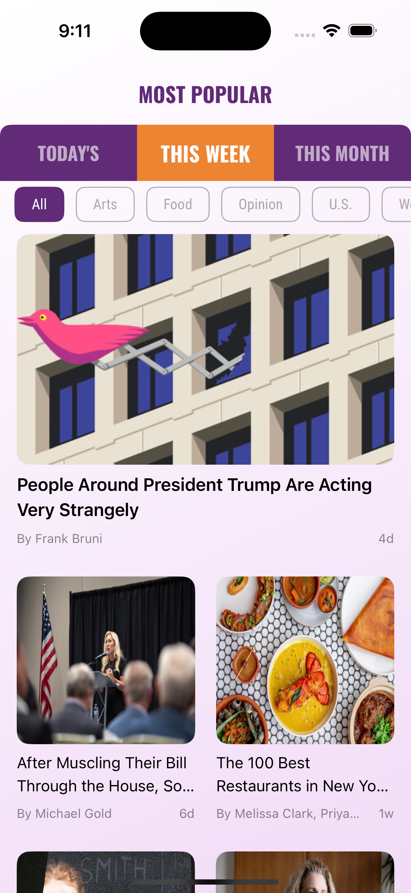
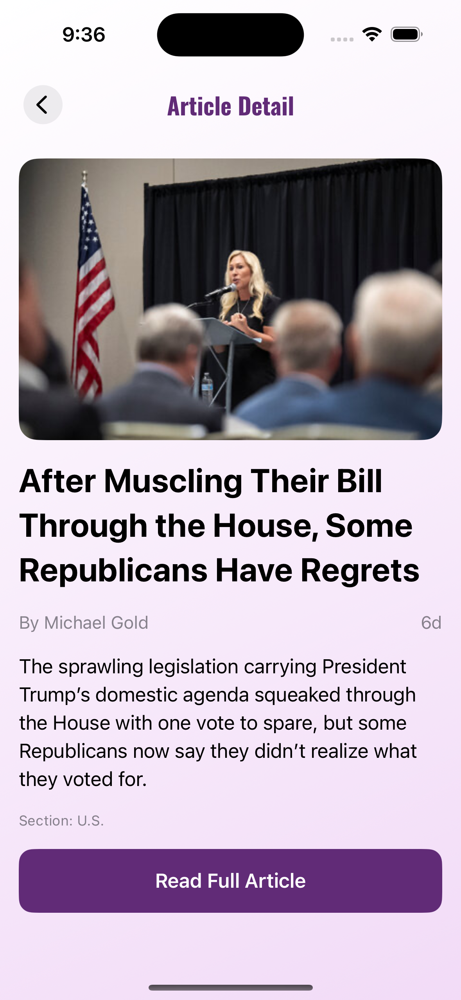
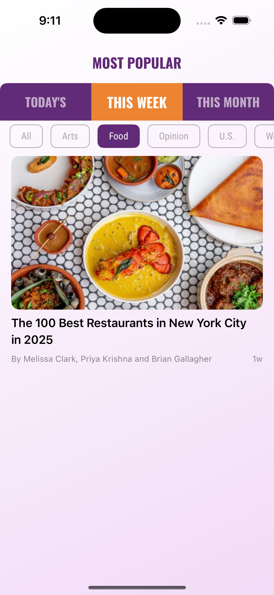
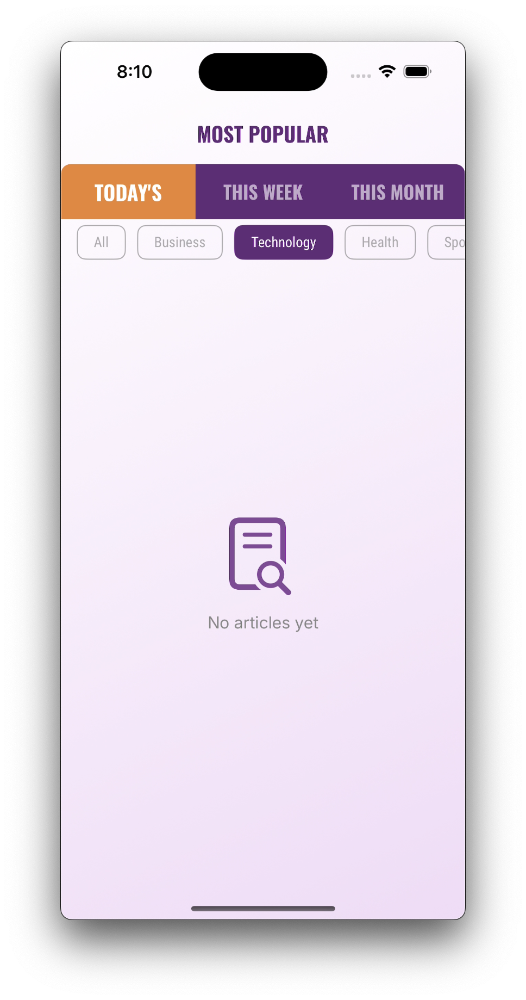
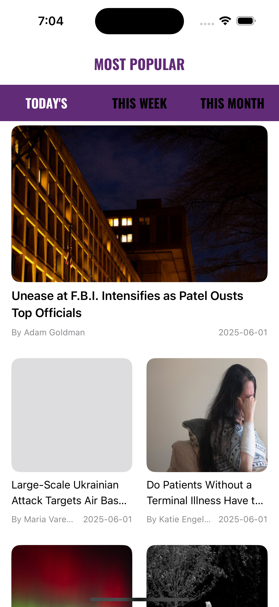
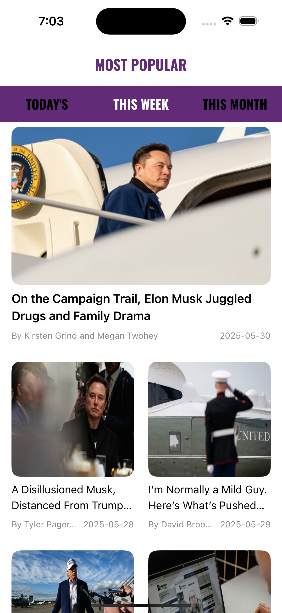
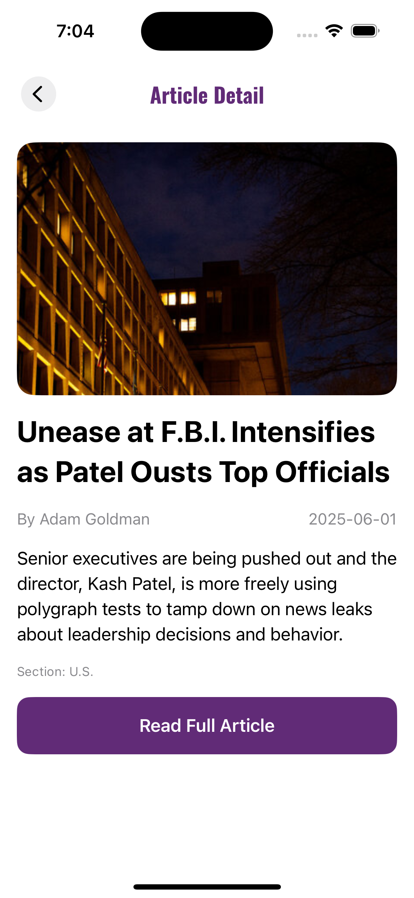

  

# ReadPop

  

A SwiftUI-based iOS application to browse the most popular articles from The New York Times. Built with MVVM architecture, Combine, and reusable UI components to deliver a modern and accessible news reading experience.

 
---

## Features

  

### Articles List (SwiftUI + Combine)

Displays a scrollable, responsive list of articles fetched from the NYT API, including:

- Article title
- Preview image
- Publication date
- Category (section)

  

### Article Details

A detailed view that showcases:

- Article image (full width)
- Full title with styling
- Author and publish date
- Summary/abstract text
- Section info
- Button to open the full article in Safari

  

### Period Filter (SwiftUI)

User can switch between most viewed articles in:

- Last 1 day
- Last 7 days
- Last 30 days


### Section Filter (Dynamic)

Users can now filter articles by section, based on the actual article data fetched from the API.

- Sections like **Business**, **Technology**, etc., are shown as selectable filters.  
- Automatically resets to **All** when the selected period changes.  
- Fully integrated into the `ArticleListViewModel`.


### Error Handling & Loading

- Custom loader view with animation

- Error view with retry capability

### Global Background Styling

- Introduced a consistent app-wide gradient background using `.applyAppBackground()` modifier  
- Applied across all major views including the article list and detail views  

### UI Polish

- Unified font styles and colors across the app using `FontTheme` and custom color assets  
  

---

  

## Technologies Used

  

- ****SwiftUI****: Modern declarative UI for building native UIs.

- ****Combine****: Reactive data flow and state binding.

- ****MVVM Architecture****: Clean separation between business logic and UI.

- ****Modular Structure****: Organized into Core, Config, Features, and UI Modules.

- ****Dependency Injection****: Manual, lightweight DI for clarity and testability.

  

---

## Design System (Colors & Fonts)

The app uses a custom design system to ensure consistent styling:

### Fonts
- **Bebas Neue**: Section headers (e.g. "MOST POPULAR")
- **Oswald Bold**: Article titles
- **Inter**: Body text and summaries
- **Roboto Condensed**: Metadata (dates, bylines)

### 🎨 Colors
- `rpPrimary`: Main brand color
- `rpPrimaryLight`: Light variation for secondary emphasis
- `rpBackground`: System-wide background
- `rpGradientStart` / `rpGradientAltStart`: Used in global gradient background
- `rpTextPrimary` / `rpTextSecondary`: Text colors

All fonts and colors are defined in the `FontTheme.swift` and `Color+Extensions.swift`.

---

## Reusable UI Components

The app defines a clean set of reusable UI components used across different screens:

| Component          | Description                                       |
|-------------------|---------------------------------------------------|
| `RPHeaderView`     | Custom header with optional back button and style |
| `PeriodSelectorView` | Horizontal selector for filtering article periods |
| `SectionFilterView` | Scrollable horizontal list for filtering by section |
| `ArticleCardView`   | Large clickable card showing article info        |
| `ArticleImageView`  | Reusable image loader with placeholder            |
| `RPLoaderView`      | Custom loading spinner                           |
| `RPErrorView`       | Full-screen error with retry option              |

Each component is written in SwiftUI with responsiveness and theming in mind.

---

## Updated Screenshots

<p align="center">
  
  
  
  
</p>


---  

## Screenshots

  


<p align="center">
  
  &nbsp;&nbsp;&nbsp;&nbsp;&nbsp;
  
  &nbsp;&nbsp;&nbsp;&nbsp;&nbsp;
  
</p>
  

---

  

## Installation

  

1. Clone the repository:

```bash

git clone https://github.com/AfnanTheeb/ReadPop.git

cd ReadPop

```

  

2. Open the project in Xcode:

```bash

open ReadPop.xcodeproj

```

  

3. Add your NYT API key in `Base.xcconfig`:

```swift

 NYT_API_KEY = "your-api-key-here"

```

  

4. Build and run the app.

  

---

  

## API Information

  

We are using the Most Popular Articles API:

  

```http

GET https://api.nytimes.com/svc/mostpopular/v2/viewed/{period}.json?api-key=your-api-key

```

- `period`: can be `1`, `7`, or `30` (days)

- Requires NYT Developer Key from [developer.nytimes.com](https://developer.nytimes.com/get-started)

  

---

  

## Testing

  

- Unit tests are provided for key view models and services

- Mocks used to isolate logic and ensure coverage

- Run tests using:

```bash

Cmd + U in Xcode

```

  

---

  

## Restrictions

  


- ✅  All article content is rendered using native SwiftUI views

  
---

  
  

## License

  

This project is licensed under the MIT License.

  

---

  

## Author

  

****Afnan Mohammed****

iOS Engineer • SwiftUI Enthusiast

[GitHub](https://github.com/AfnanTheeb)
